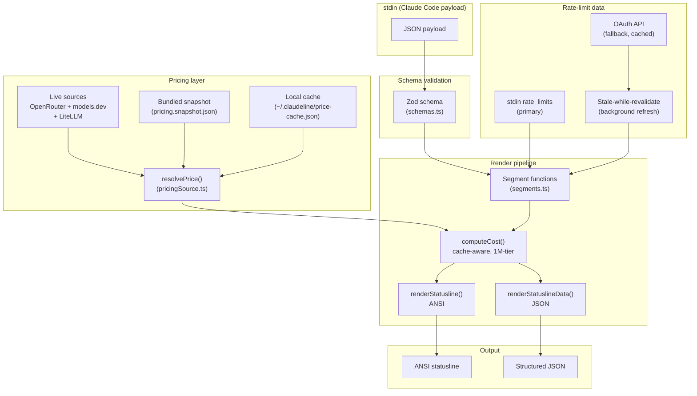
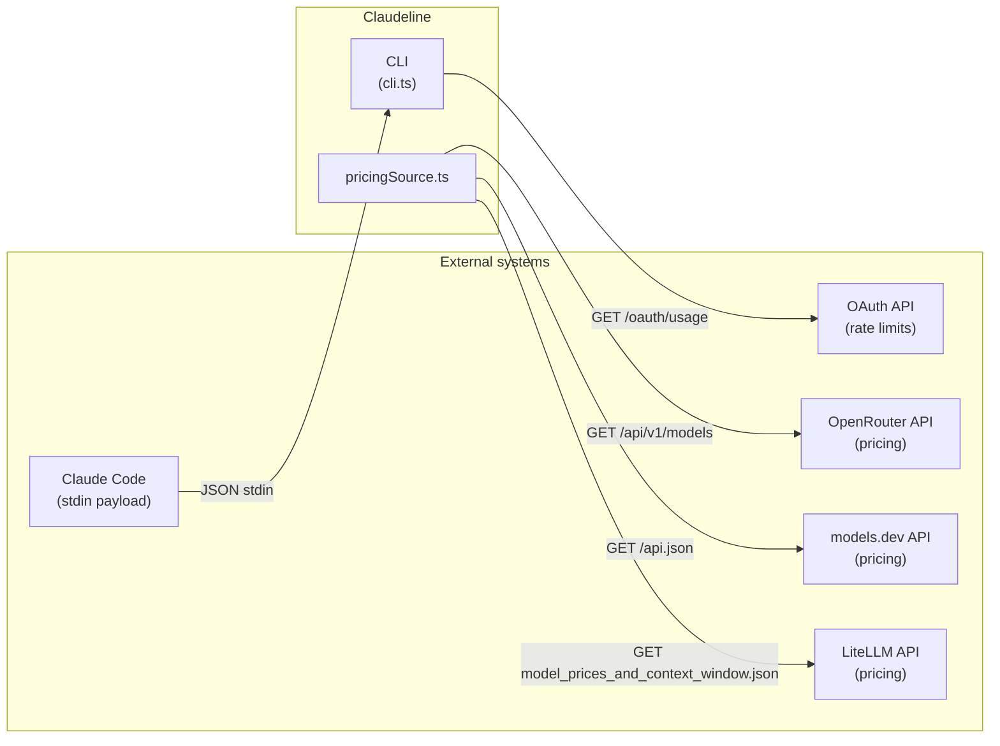
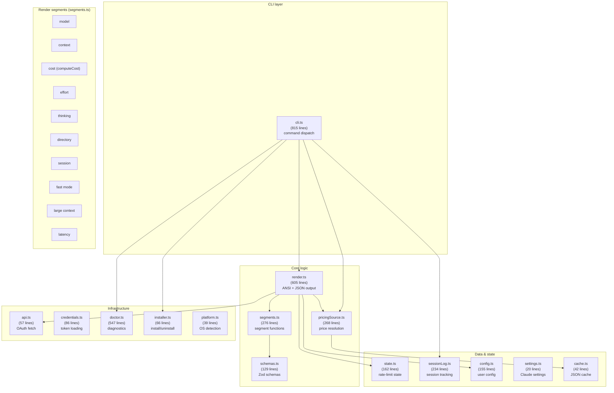
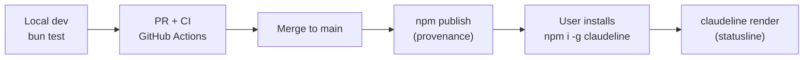
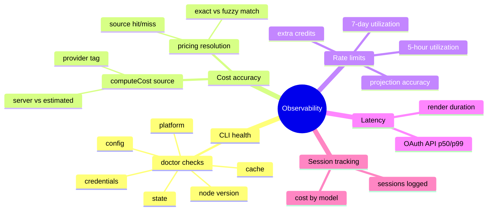
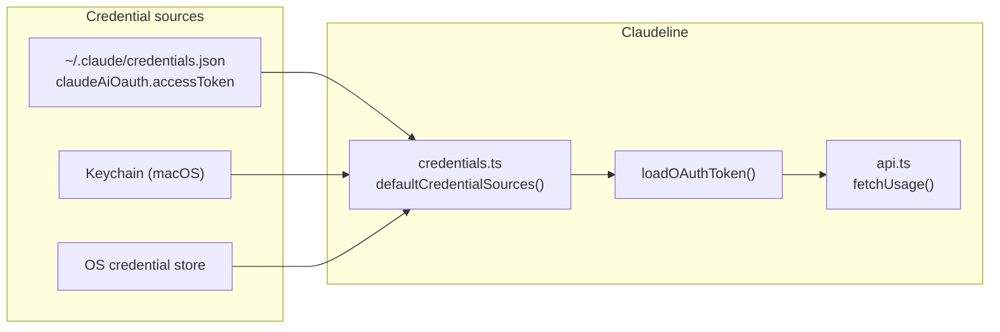
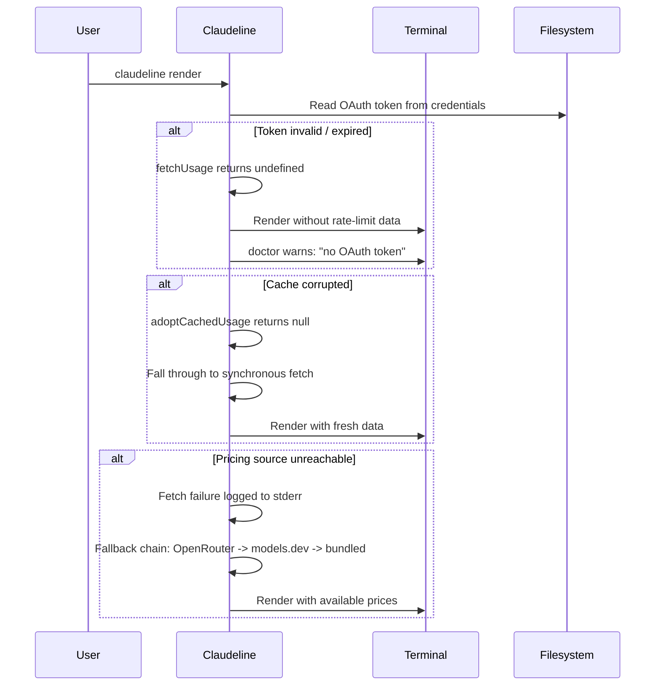
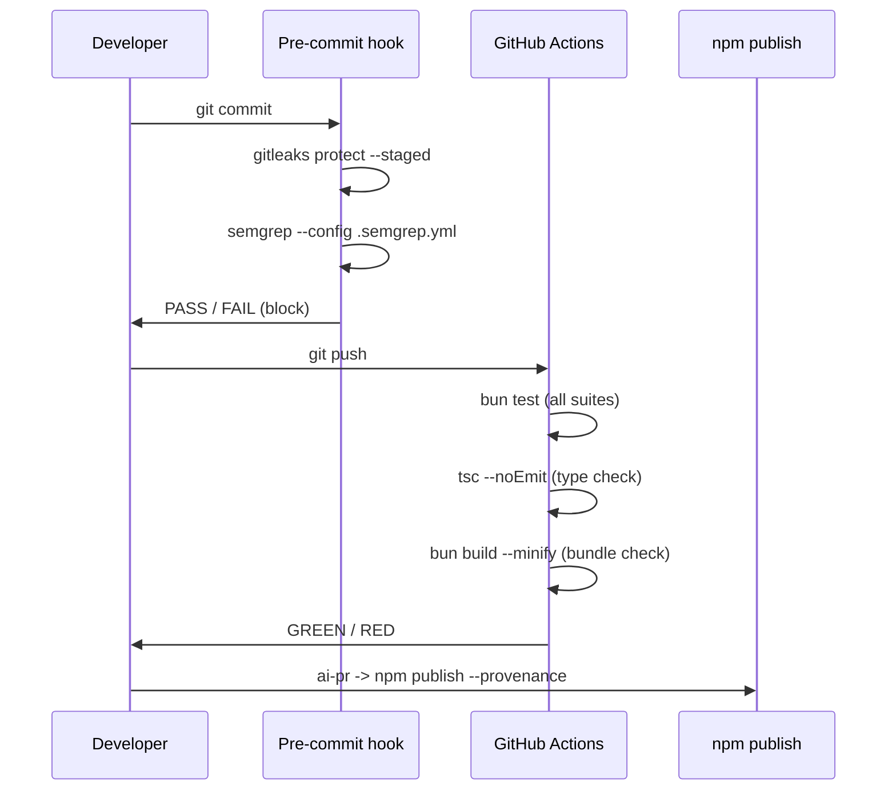

> Status: Evolving
> Last Review: 2026-07-22

# Solution Intent — Claudeline

## 1. Introduction

### 1.1 Identity

| Field | Value |
|---|---|
| Name | claudeline |
| Org / Repo | arcasilesgroup/claudeline |
| Version | 0.4.4 |
| Status | Active development (spec-001 in progress) |
| Stack | TypeScript (Node >= 18 / Bun) |
| License | MIT |
| Package | `@arcasilesgroup/claudeline` (npm, public) |

### 1.2 Objective

Cross-platform statusline for Claude Code. Single binary, zero config. Displays model, context percentage, cost, working directory, git state, rate limits, effort, thinking mode, latency, and session duration -- all from a single stdin JSON payload.

### 1.3 Problem Statement

Claude Code ships a built-in minimal statusline. Power users need richer signals -- accurate cost tracking, rate-limit projections, effort/thinking visibility, context-pressure badges -- without leaving their terminal. Existing bash statuslines are platform-limited, untested, and cannot track cost reliably across providers.

### 1.4 Desired Outcomes

- Accurate session cost for any model (Anthropic, OpenAI, open-source via OpenRouter/BYO)
- Rate-limit projection so users can plan work before hitting caps
- Cross-platform consistency (macOS, Linux, Windows) with a single binary
- Tested rendering path (TDD) -- no silent breakage on schema changes

### 1.5 Scope

**In scope:**
- ANSI statusline rendering (stdin -> formatted line)
- JSON structured output (`--json`) for editors/scripts
- OAuth API integration for rate-limit data
- Multi-provider pricing (live sources + bundled fallback)
- CLI subcommands: render, install, uninstall, doctor, summary, refresh, config
- Session logging (opt-in, local JSONL)

**Out of scope:**
- Gateway/proxy for routing to non-Anthropic providers
- Token re-estimation across providers (we price reported tokens only)
- Batch-workflow cost tracking
- Local model hosting (Ollama/LM Studio) -- pricing only
- Configuration UI

### 1.6 Stakeholders and Personas

| Persona | Journey | Primary Actions |
|---|---|---|
| Solo developer (Claude Code user) | Daily coding sessions | Reads statusline passively; runs `doctor` on setup; runs `summary` to check spend |
| Multi-model power user | Uses Claude + GPT + open-source via OpenRouter | Expects accurate cost for all models; relies on effort/thinking badges |
| Editor integration | VS Code / JetBrains statusline bar | Consumes `--json` output; needs stable schema |

---

## 2. Requirements (Solution Intent)

### 2.1 High-Level Solution Architecture

### 2.2 Functional Requirements by Domain

**Pricing**

| Domain | Requirement | Priority | Status |
|---|---|---|---|
| Multi-provider resolution | Resolve model IDs across Anthropic, OpenAI, Google, Llama, Mistral, DeepSeek, xAI, community | P0 | Implemented (spec-001) |
| Live price sources | OpenRouter (open/BYO) + models.dev (Claude) + LiteLLM (fallback) | P0 | Implemented (pricingSource.ts) |
| Bundled fallback | Seed from snapshot.json; render never blocks | P0 | Implemented |
| 1M-context surcharge | `LONG_CONTEXT_MULTIPLIER = 2` applied to estimated cost | P1 | Implemented (segments.ts:171) |
| Cache-aware cost | Cache read/write priced as distinct line items | P1 | Implemented (segments.ts:193-196) |
| Recompute default | `current_usage * live price` primary; server cost fallback only when `current_usage` null | P0 | Implemented (segments.ts:184-216) |

**Rendering**

| Domain | Requirement | Priority | Status |
|---|---|---|---|
| Model segment | Display model name, color by palette | P0 | Implemented (segments.ts:18-24) |
| Context percentage | Color-coded by usage threshold (green -> red) | P0 | Implemented (segments.ts:38-56) |
| Cost segment | Dollar amount from computeCost, yellow palette | P0 | Implemented (segments.ts:218-228) |
| Effort segment | Render level when present; hide when absent | P1 | Implemented (segments.ts:121-129) |
| Thinking segment | Brain glyph when enabled | P1 | Implemented (segments.ts:131-137) |
| Directory + git | Branch, dirty flag, worktree marker | P0 | Implemented (segments.ts:66-80) |
| Session duration | Elapsed time since session start | P1 | Implemented (segments.ts:82-98) |
| Fast mode badge | Rabbit glyph when `--fast` | P2 | Implemented (segments.ts:243-249) |
| Large context warning | Yellow glyph when exceeds 200K tokens | P2 | Implemented (segments.ts:251-257) |
| Latency badge | Yellow/red badge when OAuth API is slow | P2 | Implemented (segments.ts:264-276) |
| Null/clear handling | Empty segments on null `current_usage`, no NaN garbage | P1 | Implemented (segments.ts:41-43, 191-203) |

**CLI**

| Domain | Requirement | Priority | Status |
|---|---|---|---|
| `render` | Read stdin JSON, emit ANSI or `--json` output | P0 | Implemented (cli.ts:270-369) |
| `install` / `uninstall` | Wire/unwire statusLine in `~/.claude/settings.json` | P0 | Implemented (installer.ts) |
| `doctor` | Diagnostic report (pass/warn/fail), `--json` variant | P1 | Implemented (doctor.ts) |
| `summary` | Local session history, `--enable`/`--disable` tracking | P2 | Implemented (sessionLog.ts) |
| `refresh` | Force OAuth API fetch, bypass cache TTL | P1 | Implemented (cli.ts:546-581) |
| `config get/set/unset/edit` | Manage `~/.claudeline/config.json` | P2 | Implemented (cli.ts:589-728) |

### 2.3 Non-Functional Requirements

| Category | Requirement | Threshold | Measurement |
|---|---|---|---|
| Cold start latency | Single render from stdin to stdout | p50 < 200ms | `tests/cli.test.ts` |
| Bundle size | Single-file output (`dist/cli.js`) | < 500KB minified | `bun build --minify` |
| Runtime dependency | npm install footprint | 1 production dep (zod) | `package.json` |
| Test coverage | Unit + integration tests | > 80% lines | `bun test` |
| Schema validation | Tolerate null and unknown fields | Zod `looseObject` | `schemas.ts` |
| Platform support | macOS, Linux, Windows | Node >= 18 or Bun | `engines` field |

### 2.4 Integrations

| System A | System B | Protocol | Contract | SLA |
|---|---|---|---|---|
| Claude Code | Claudeline | stdin JSON | `statuslineInputSchema` (Zod, `schemas.ts`) | Claude Code emits payload on each prompt |
| Claudeline | OAuth API | HTTPS GET | `usageApiSchema` (Zod, `schemas.ts`) | Cached 30s default; SWR at 5s |
| Claudeline | OpenRouter | HTTPS GET (keyless) | `pricing.*.prompt/completion` strings (USD/token) | Edge-cached ~5 min |
| Claudeline | models.dev | HTTPS GET (keyless) | `cost.{input,output,cache_*}` numbers ($/1M) | Public API |
| Claudeline | LiteLLM | HTTPS GET (keyless) | `*_cost_per_token` numbers (USD/token) | Public JSON on GitHub |

---

## 3. Technical Design

### 3.1 Stack and Architecture

**Stack table**

| Layer | Component | Technology |
|---|---|---|
| Runtime | Node.js / Bun | ES2022, ESNext modules |
| Validation | Zod v4 | Schema validation with `looseObject` tolerance |
| Build | Bun | Single-file bundle (`bun build --target=node`) |
| Pricing | OpenRouter, models.dev, LiteLLM | HTTPS GET, keyless |
| Auth | OAuth token | Claude Code credential sources |
| Distribution | npm | `@arcasilesgroup/claudeline` (public, provenance) |
| VCS | GitHub | arcasilesgroup/claudeline |
| IDE surface | Claude Code | Primary surface (stdin -> statusline) |

### 3.2 Environments

| Environment | Purpose | Variables | Secrets | Network |
|---|---|---|---|---|
| Development | Local dev + `bun test` | `CLAUDELINE_GLYPHS`, `CLAUDELINE_PREFER_API`, `CLAUDELINE_CACHE_TTL_SEC` | OAuth token (from Claude Code credentials) | OpenRouter, models.dev, LiteLLM (fetch on `refresh`) |
| CI | GitHub Actions | Same as dev | None (tests use fixtures) | None (mocked) |
| Production | Installed via npm/bun | Same as dev | OAuth token | OAuth API, pricing sources |

### 3.3 API and Gateway Policies

| Surface | Auth | Rate Limit | Versioning |
|---|---|---|---|
| stdin JSON (Claude Code) | None (local pipe) | Unbounded (Claude Code controls cadence) | Schema version in `StatuslineData.version` |
| OAuth API | Bearer token | Claude Code managed | N/A (consumed, not owned) |
| OpenRouter | None (keyless) | Edge-cached, ~5 min TTL | N/A (consumed) |
| models.dev | None (keyless) | Public API | N/A (consumed) |

### 3.4 Publication and Deployment

| Artifact | Method | Target | Trigger |
|---|---|---|---|
| `dist/cli.js` | `bun build --minify` | npm package | `prepublishOnly` |
| `dist/claudeline` | `bun build --compile` | Binary (5 platforms) | Manual / CI release |
| npm package | `npm publish --provenance` | npmjs.org | `ai-pr` or manual |

---

## 4. Observability Plan

### 4.1 What We Measure

### 4.2 SLIs / SLOs / Alerts

| Signal | SLI | SLO | Alert Threshold | Action |
|---|---|---|---|---|
| Render latency | p50 cold start | < 200ms | > 300ms p50 | Investigate Zod parse or pricing resolution |
| Pricing resolution | hit rate (exact + fuzzy) | > 95% for known models | < 80% hit rate | Update bundled snapshot |
| OAuth cache hit | cache served without fetch | > 70% of renders | < 50% | Check TTL config, SWR |
| Doctor pass rate | all checks pass | 100% on clean install | Any FAIL | Fix installer or platform detection |

### 4.3 Logging and Reporting

| Log Type | Format | Retention | Location |
|---|---|---|---|
| Pricing fetch errors | stderr (console.error) | Ephemeral | Terminal |
| Session log | JSONL | Until user runs `--disable` | `~/.claudeline/sessions.jsonl` |
| Doctor report | ANSI tree or JSON | Ephemeral | stdout |
| State (rate-limit samples) | JSON | Indefinite | `/tmp/claudeline-<uid>/state.json` |

### 4.4 Runbooks

| Runbook | Cadence | What it does |
|---|---|---|
| `architecture-drift` | weekly | Compare codebase against solution-intent for layer violations |
| `code-quality` | weekly | Detect complexity hotspots, duplication, tech-debt |
| `dependency-health` | weekly | Scan for outdated deps, CVEs, license issues |
| `docs-freshness` | weekly | Detect stale documentation and doc-vs-code drift |
| `feature-scanner` | daily | Scan commits/PRs for unimplemented features |
| `governance-drift` | weekly | Verify mirror sync, quality-gate config, hook integrity |
| `performance` | weekly | Detect performance regressions and bundle-size growth |
| `security-scan` | weekly | Scan for secrets, OWASP/SAST patterns |
| `stale-issues` | daily | Label idle issues, auto-close after 21 days |
| `triage` | daily | Classify open issues by type and priority |
| `refine` | daily | Draft acceptance criteria for triaged issues |
| `consolidate` | weekly | Group related work items for brainstorm |
| `wiring-scanner` | weekly | Detect implemented but disconnected code |
| `work-item-audit` | weekly | Audit non-functional work items against reality |

---

## 5. Security

### 5.1 Authentication and Authorization

| Provider | Auth Method | Scope |
|---|---|---|
| Claude Code OAuth | Bearer token from credential sources | Rate-limit usage data only |
| OpenRouter | None (keyless) | Public pricing data |
| models.dev | None (keyless) | Public pricing data |
| LiteLLM | None (keyless) | Public pricing data |

### 5.2 Exposure Model

| Surface | Visibility | Data Classification | Controls |
|---|---|---|---|
| stdin JSON | Local pipe only | Internal (model, tokens, cost) | Per-uid cache directory (`/tmp/claudeline-<uid>`) |
| OAuth token | Local filesystem | Secret | Read from existing Claude Code credentials; never logged |
| Pricing cache | Local filesystem | Public (market prices) | Written with `0o600`; per-uid directory |
| Session log | Local filesystem (opt-in) | Internal (cost, model, cwd) | User-initiated only; deleted on `--disable` |
| ANSI output | Terminal | Internal | Control chars stripped from reflected text (`stripControl`) |

### 5.3 Compromised Process Recovery

### 5.4 Hardening Checklist

| Check | Tool | Gate | Status |
|---|---|---|---|
| Secret scanning | gitleaks | Pre-commit | Active |
| SAST | semgrep (.semgrep.yml) | Pre-push | Active |
| Control-char injection | `stripControl()` in segments.ts | Code review | Implemented |
| Per-uid isolation | `/tmp/claudeline-<uid>/` + `0o700` mkdir | Code | Implemented |
| Schema validation | Zod `looseObject` | Runtime | Implemented |
| No PII in committed files | Anonymous content rule | CONSTITUTION 13.4 | Enforced |

---

## 6. Quality

### 6.1 Quality Gates

| Gate | Tool | Threshold | Mode |
|---|---|---|---|
| Coverage | `bun test` | 80% | regulated |
| Duplication | TBD | 3% | regulated |
| Cyclomatic complexity | TBD | 10 | regulated |
| Cognitive complexity | TBD | 15 | regulated |
| Type checking | `tsc --noEmit` | 0 errors | always |
| Bundle size | `bun build --minify` | < 500KB | CI |

### 6.2 Architecture Patterns

| Pattern | Where Applied | Why |
|---|---|---|
| Single Responsibility | `pricingSource.ts` (pricing only), `segments.ts` (segments only), `render.ts` (orchestration only) | Each module has one reason to change |
| Dependency Injection | `RenderDeps` interface in render.ts | Testability -- mock all I/O |
| Loose Schema Tolerance | `looseObject` + `nullish` wrappers in schemas.ts | Resilient to Claude Code schema evolution |
| Stale-While-Revalidate | Background `_refresh` spawn in cli.ts | Non-blocking cache freshness |
| Fallback Chain | Pricing: OpenRouter -> models.dev -> LiteLLM -> bundled | Graceful degradation on network failure |

### 6.3 Testing Strategy

| Level | Tool | Coverage Target | Current |
|---|---|---|---|
| Unit (segments) | `bun test` | 90% | 276 lines segments.ts |
| Unit (pricing) | `bun test` | 90% | 268 lines pricingSource.ts |
| Unit (CLI) | `bun test` | 80% | 815 lines cli.ts |
| Integration (render) | `bun test` | 85% | 605 lines render.ts |
| Schema validation | Zod (runtime) | 100% of input fields | 129 lines schemas.ts |
| Doctor diagnostics | `bun test` | 80% | 547 lines doctor.ts |

### 6.4 Scalability Plan

| Dimension | Current | Target | Strategy |
|---|---|---|---|
| Pricing rows | ~6 bundled | 1000+ (live) | Fetch from OpenRouter + models.dev; cache locally |
| Platform | macOS, Linux, Windows | Same | Bun single-file build; no native deps |
| IDE surfaces | Claude Code | Claude Code + Codex | Schema-driven; new surfaces add input adapters |
| Session log size | Unlimited JSONL | 10K records | Rotation logic in sessionLog.ts |

---

## 7. Next Objectives

### 7.1 Roadmap

| Phase | Description | Status |
|---|---|---|
| v0.4.x | Core statusline (model, context, cost, git, rates) | Released |
| spec-001 | Multi-provider pricing fidelity + CC feature parity | In progress (draft branch) |
| v0.5.x | Session analytics, export, multi-model cost comparison | Planned |
| IDE expansion | Codex, GitHub Copilot surface support | Planned |

### 7.2 Active Epics / Features

| Epic | Description | Priority | Status | Target |
|---|---|---|---|---|
| spec-001: Pricing fidelity | Multi-provider live pricing, recompute default, effort/context parity, null handling | P0 | Active (draft branch `draft/claudeline-pricing-cc-features`) | v0.5.0 |

### 7.3 KPIs

| Metric | Target | Current |
|---|---|---|
| npm weekly downloads | TBD | TBD |
| Test coverage | > 80% | Passing (bun test) |
| Cold start p50 | < 200ms | ~85-140ms |
| Pricing hit rate (known models) | > 95% | ~100% (bundled Anthropic rows) |
| Dependency count (prod) | 1 | 1 (zod) |

### 7.4 Active Spec

| Spec | Status | Branch | Plan |
|---|---|---|---|
| [spec-001](specs/spec.md) | approved | `draft/claudeline-pricing-cc-features` | [plan.md](specs/plan.md) (9 concerns, 12 files, 17 tasks) |

### 7.5 Blockers and Risks

| ID | Description | Severity | Owner | Expiry |
|---|---|---|---|---|
| R-001 | OpenRouter speculative/unreleased 2026 model entries in pricing | Medium | spec-001 | Until bundled snapshot pinned |
| R-002 | Network/offline at fetch time (OpenRouter, models.dev down) | High | spec-001 | Mitigated by fallback chain |
| R-003 | OpenRouter price is a proxy, not exact first-party Anthropic invoice | High | spec-001 | Resolved: separate Anthropic source |
| R-004 | `cost.total_cost_usd` wrong for non-Anthropic models | High | spec-001 | Resolved: ignored for non-Anthropic |
| R-005 | Breaking price change from upstream (no compat shim) | Medium | spec-001 | CHANGELOG documents breakage |
